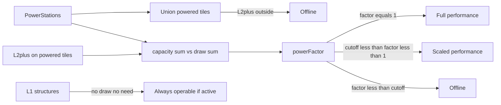

# Milestone 25 — Power stations: capacity + area of effect

**GitHub:** https://github.com/zachflem/hexWorld/issues/70  
**Status:** Implemented (Milestone 25 / #70) — balance numbers still first-pass / untested

Refactor power away from a fifth stockpiled extraction resource into **power stations** that supply **capacity** over an **area of effect**. Structures in range **draw** load; under-supply degrades performance and can cut consumers offline. Level/tier 1 structures never need power.

This file is the design + impl brief. Balance numbers below are first-pass placeholders until playtest.

---

## Context

**Today:** `power` is a peer of food/wood/stone/steel — `ExtractionTile { resource: "power" }`, path drain into `game.resources.power`, HUD fifth slot, storage level, late upgrade tech (`L3_to_L4` includes power). Rush-with-power is documented in PLAYER_GUIDE but **not** implemented (rush is noise-only).

**Target:** stations with level-scaled capacity + AoE; engine can answer station locations, powered tiles, capacity, draw, and under/over. Power leaves `ResourceType` / the stockpile bar.

ScrapperEconomy Q13 previously deferred power logistics; this milestone **supersedes** that deferral with the station model (not a Scrapper haul loop).

---

## Model



### Power stations

New structure kind (tower-shaped record), **not** an extraction tile:

| Field | Notes |
|-------|--------|
| `coord` | Owned land hex |
| `level` | 1…`MAX_POWER_STATION_LEVEL` (propose 4, mirror towers) |
| `upgrade` | `{ targetLevel, startedAt } \| null` |
| `buildStartedAt` | Under construction |
| `damaged` / `damageRepair` | Same capture/repair rules as other land structures |
| `totalInvested` / `buildCost` | Demolish/refund |

**Stats (tweaks):**

- `capacity(level) = capacity_base + capacity_per_level * (level - 1)`
- `aoeRadius(level) = aoe_base_tiles + aoe_per_level * (level - 1)` (integer tile radius; cover via `axialSpiral`, same as towers)

Inactive stations (`!isStructureActive` — damaged or still building) contribute **neither** capacity nor AoE. Stations **do not draw** power.

**Placement:** owned land, not base hex, `isBuildableLand`, `!isHexOccupied`, under build-slot cap — same gates as towers. Costs wood/stone/steel (no former power currency).

### Coverage + capacity pool (overlap)

- **Union coverage:** powered tile set = union of all active stations’ AoE discs (including the station’s own tile).
- **Shared pool:** `totalCapacity = Σ capacity(station)`; `totalDraw = Σ draw(consumer)` for consumers that currently count (see below).
- One global `powerFactor` for the network (not per-station claim).

### Who draws / who needs power

| Level / tier | Needs coverage? | Draws? |
|--------------|-----------------|--------|
| Level/tier **1** | No | No — operates anywhere (subject to `isStructureActive` only) |
| Level/tier **≥ 2** | Yes | Yes, if active and on a powered tile |

**Tier → level** (existing maps):

- Extraction: `small=1`, `mid=2`, `large=3`
- Path: `goat_track=1`, `stone_road=2`, `highway=3`
- Wall: `wood=1`, `rock=2`, `steel=3`
- Tower / barracks / dock / base: numeric `level`

**Consumers (map structures only):** extraction, path, tower, wall, barracks, dock.  
**Non-consumers:** power stations; **base** hub ops (storage upgrades, research/lab timers, base level-up); outposts as hubs; units/upkeep (food only). Hub work does **not** require a powered tile under the base.

**Draw formula (active L2+ on a powered tile):**

```
draw(structure) = draw_base[kind] * level
```

(`level` from numeric level or tier→level). Structures outside coverage contribute **0** draw (they are offline, not brownout). Damaged / building structures do not draw.

First-pass `draw_base` placeholders (units arbitrary — tune in playtest):

| Kind | `draw_base` |
|------|-------------|
| extraction | 2 |
| path | 1 |
| tower | 3 |
| wall | 1 |
| barracks | 4 |
| dock | 2 |

### Power factor + cut-off

```
if totalDraw <= 0:
  powerFactor = 1
else:
  powerFactor = clamp(totalCapacity / totalDraw, 0, 1)

cutoff = power.cutoff_factor   // e.g. 0.5
```

Per structure that **requires** power (L2+):

| Condition | State | Effect |
|-----------|--------|--------|
| Coord not in powered set | **Unpowered / offline** | Same operational gate as inactive for *effects* (no yield/DPS/train/path flow/wall dampening contribution). Still occupies the hex; can be upgraded/repaired/demolished per normal UI rules. |
| On powered set, `powerFactor >= 1` | **Full** | Normal performance |
| On powered set, `cutoff <= powerFactor < 1` | **Degraded** | Scale continuous performance by `powerFactor` |
| On powered set, `powerFactor < cutoff` | **Cut off / offline** | Same as unpowered |

L1 structures ignore the table (always full if `isStructureActive`).

### Performance scaling (degraded)

| Kind | Scaled by `powerFactor` | Unchanged |
|------|-------------------------|-----------|
| Extraction / dock | Yield per tick | — |
| Tower | Damage per tick | Range, claim radius |
| Barracks | Train completion rate (duration effectively ÷ factor, or progress × factor) | Unit capacity caps |
| Path | Transport / drain rate | Connectivity graph topology |
| Wall | Noise dampening amount; treat as continuous effect | Max durability / hits-to-break table (static). Damage-taken while cut off: wall still occupies tile but contributes **0** dampening and **0** garrison-range bonus (offline). |

Offline / cut-off structures: yield 0, DPS 0, no path throughput through that tile (treat like inactive for logistics), no wall dampening / garrison bonus, barracks cannot make train progress (queued work pauses).

**Impl note:** prefer a dedicated `structurePowerState(game, coord) → "exempt" \| "full" \| "degraded" \| "offline"` (or equivalent) rather than overloading `isStructureActive` (which stays damaged/build-only). Call sites that currently gate on `isStructureActive` for *effects* also consult power state for L2+.

### Engine query surface

Pure helpers in `src/engine/power.ts` (names indicative):

- `listPowerStations` / stations on `GameState`
- `poweredTiles(stations, tweaks) → Set<AxialKey>`
- `totalPowerCapacity`, `totalPowerDraw`
- `powerFactor(capacity, draw, cutoff)`
- `structurePowerState(...)` / `powerPerformanceFactor(...)` (0 if offline, else factor for degradable effects)

---

## Spend / rush cleanup

Power leaves the stockpile economy entirely.

| Former use | Replacement |
|------------|-------------|
| `resources.power` hub pool | Removed |
| Power extraction tiles | Replaced by power stations |
| `storageLevels.power` / storage upgrade for power | Removed |
| Tower / barracks `L3_to_L4` tech includes `"power"` | Drop `"power"` from chains; keep wood→stone→steel (or add a modest extra steel amount in tweaks if L4 feels too cheap — optional balance note, not a new resource) |
| Extraction `power` build/upgrade costs | N/A — kind removed |
| PLAYER_GUIDE “Rush with power” | **Remove** — rush stays noise-only (matches current code) |

Demolish/repair maps must not expect a `power` key after migration.

---

## Save migration

On load of any save that still has stockpile power / power extraction:

1. For each `ExtractionTile` with `resource: "power"`: create `PowerStation` at same `coord`, `level: 1`, copy `damaged` / `buildStartedAt` / repair fields where applicable; `totalInvested` keep non-power keys only (strip `power`).
2. Remove those extraction tiles from the array.
3. Set hub `resources.power` unused → strip key; ensure `ResourceAmounts` is four-resource after schema change.
4. Drop `storageLevels.power`.
5. Strip any `power` keys from `totalInvested` / `buildCost` on remaining structures.
6. Bump `SAVE_FILE_VERSION` (or add an explicit one-shot migrator) so the transform is idempotent.

New games: never create power extraction; `ResourceType` end state is `"food" \| "wood" \| "stone" \| "steel"` only.

---

## Tweaks keys (first-pass placeholders)

New block `power` (profile `tweaks.jsonc` + Zod in `tweaksSchema.ts`):

```jsonc
"power": {
  "max_level": 4,
  "capacity_base": 20,
  "capacity_per_level": 15,
  "aoe_base_tiles": 2,
  "aoe_per_level": 1,
  "cutoff_factor": 0.5,
  "build_cost_base": { "wood": 400, "stone": 300, "steel": 150 },
  "upgrade_cost_base": { "wood": 200, "stone": 200, "steel": 100 },
  "build_time_minutes": 3,
  "upgrade_time_minutes_base": 4,
  "draw_base": {
    "extraction": 2,
    "path": 1,
    "tower": 3,
    "wall": 1,
    "barracks": 4,
    "dock": 2
  },
  "noise_build": 8,
  "noise_upgrade": 6,
  "passive_noise_floor_per_level": 4
}
```

**Remove / rewrite:**

- `resources.types` / `rarity_order` / `starting_amounts.power`
- `extraction_tiles.power` (+ terrain multiplier row for power)
- `storage.upgrade_cost_base.power`
- `noise.passive_gathering_noise_floor.power`
- `"power"` from `towers.upgrade_tech_progression.L3_to_L4` and `barracks.upgrade_tech_progression.L3_to_L4`

---

## HUD / UX

- **Resource bar:** four resources (food → wood → stone → steel) + noise. Drop power slot and `icon-power` from the bar (marker may remain for other uses or retire with extraction art).
- **Station selected:** show capacity, current network draw, `powerFactor` (or % supply), AoE shade on map (copy tower range shading).
- **Optional global cue:** when `powerFactor < 1`, a compact brownout / cut-off indicator (not a fifth resource pip).
- **Build menu:** “Power station” option on empty owned land; remove “Power” extraction build option.
- **Tile panel for L2+ offline:** clear reason — “No power” vs “Power cut off (overload)”.

---

## File layout (implementation preview)

**New:**

- `src/data/powerStations.ts` — record, `POWER_STATIONS_DB_KEY`, max level
- `src/engine/power.ts` — capacity, AoE, draw, factor, power state helpers
- `src/engine/power.test.ts`
- `public/profiles/default/assets/structures/power-station.png` (+ optional `power-station-{1..4}`) — can temporarily reuse `power-small` stems via placement aliases until art ships
- `context/Milestone25.md` (this file)

**Touched:**

- `src/data/resources.ts` — remove `"power"` from `ResourceType` / helpers
- `src/data/extractionTiles.ts`, `src/data/storageLevels.ts`, `src/data/tweaksSchema.ts`
- `public/profiles/*/tweaks.jsonc`
- `src/data/gamePersistence.ts` — key + migration
- `src/App.tsx` — `GameState.powerStations`, build/upgrade/tick/demolish, `isHexOccupied`, `totalStructureCount`
- `src/engine/tick.ts`, `resourceRates.ts`, `towers.ts`, `barracks.ts`, `paths.ts`, `noiseMeter.ts`, `docks.ts`, `formulas.ts` (or call sites) — apply power factor / offline
- `src/ui/hud/ResourceHud.tsx`, `src/ui/GameScreen.tsx`, `src/ui/tileOptions.ts`
- `src/render/structureSprites.ts`, `structurePlacement.ts`, `HexCanvas.tsx` — station draw + AoE shade
- Docs: DESIGN, PLAYER_GUIDE, TWEAKS, ScrapperEconomy Q13 (see below)

**Precedents:**

- AoE: `towerRange` + `axialSpiral` / `autoClaimTowerRange` in `src/engine/towers.ts`, `src/engine/territory.ts`
- Capacity sum: `militiaCapacity` in `src/engine/barracks.ts`
- Structure add pattern: barracks/tower (data → engine → tweaks → persistence → App handlers → UI → render)

---

## Doc sync (exact edits for the impl PR)

Apply these when code ships (not in the design-only commit unless you want the fiction updated early).

### [`context/DESIGN.md`](DESIGN.md)

- **§ loop / Extract:** “food, wood, stone, steel, and power” → four stockpile resources; power is **generated by power stations** (capacity + AoE), not extracted into a pool.
- **§5 Resources:** rarity order becomes food → wood → stone → steel. New subsection **Power network**: stations, union AoE, shared capacity vs draw, L1 exempt, brownout (`powerFactor`) and cut-off.
- **§ extraction tiers:** remove “steel and power infrastructure” wording that implies power tiles; point tech climax at steel extraction + power **stations**.
- **§10 / structures:** one-structure-per-tile list includes power stations.
- **Out of scope / shipped notes:** mention M25 / #70 when implemented.

### [`context/PLAYER_GUIDE.md`](PLAYER_GUIDE.md)

- Resources section: four types; explain stations (place → cover tiles → upgrade for more capacity/range).
- Remove “five types … power” and any **Rush … spend power** wording (timer tray: Rush = noise spike only, if Rush remains).
- Building list: add Power station; remove Power extraction tile.
- Short “brownout / no power” player tip for upgraded buildings outside coverage or on an overloaded grid.

### [`context/TWEAKS.md`](TWEAKS.md)

- Remove power extraction yield/cost/noise/storage rows.
- Document new `power.*` block (capacity, AoE, cutoff, draw_base, build/upgrade).
- Update tech progression notes: L3→L4 no longer spends power.
- Flag all new numbers **first pass, untested**.

### [`context/ScrapperEconomy.md`](ScrapperEconomy.md)

Replace Q13 body:

```markdown
### Q13 — Power resource

**Decision (superseded by Milestone 25 / issue #70):** Power is **not** a stockpiled extraction
resource and does **not** use the Scrapper haul loop. Power stations supply capacity over an AoE;
see [Milestone25.md](Milestone25.md).
```

### [`context/attribution.md`](attribution.md)

Only if new station art attribution differs from reused `power-*` extraction sprites.

---

## Acceptance / testable outcome

When implementation ships:

- [ ] Power is not a stockpiled extraction resource peer of food/wood/stone/steel (`ResourceType` has no `power`; no power extraction build; HUD has four resources).
- [ ] Power stations expose capacity + AoE that increase with level; inactive stations supply neither.
- [ ] L1 structures operate without coverage and do not draw; L2+ outside coverage are offline.
- [ ] Buildings in range draw; draw scales with level; `powerFactor = capacity/draw` degrades performance until `powerFactor < cutoff`, then cut off.
- [ ] Engine answers: station locations, powered tiles, capacity, draw, factor, per-structure power state.
- [ ] Saves with old power tiles/stockpile migrate to L1 stations + stripped power keys.
- [ ] DESIGN / PLAYER_GUIDE / TWEAKS / ScrapperEconomy Q13 updated per Doc sync above.

---

## Verification (impl PR)

- `npm test` / `npm run lint` / `npm run build`
- Manual: place station → upgrade a nearby extractor to mid → confirm yield; demolish station → mid goes offline; L1 still works; overload with many L2+ → brownout then cut-off past cutoff; load a pre-migration save with a power tile.

---

## Out of scope (this milestone’s design)

- Final balance numbers (placeholders only).
- Per-station (non-global) networks or power lines / path-carried power.
- Rush-with-power currency.
- Scrapper-style haul for power.
- New art pack requirement (reuse/alias acceptable for first ship).
