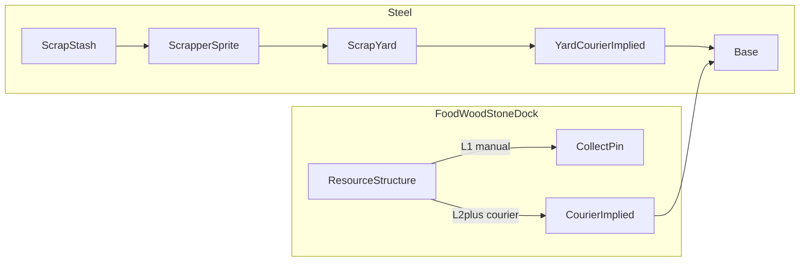

# Milestone 26 — Scrappers & Couriers (replace paths)

**GitHub:** [issue #36](https://github.com/zachflem/hexWorld/issues/36) · [milestone M26](https://github.com/zachflem/hexWorld/milestone/25)  
**Status:** Implementation in progress on `goblin` (#36 ACTIVE) — couriers + path strip done; **scrap stashes** world-gen/UI/samples live; Scrap Yard / Scrapper + steel extraction removal still open 
**Design Q&A:** [ScrapperEconomy.md](ScrapperEconomy.md) (Q1–Q70)

Replace **infrastructure path tiles** and **passive steel extraction** with two logistics roles:

1. **Scrapper** — dedicated wandering-scout-like sprite; **yard → stash → yard**.
2. **Courier** — implied unit on resource structures (and Scrap Yard last-mile); **structure → base → structure**.

This file is the design + impl brief. Balance numbers stay in tweaks / playtest.

---

## Context

**Today:**

- Food / wood / stone / steel extraction tiles accrue a local stockpile; **path chains** drain into the shared pool (`engine/paths.ts`, `accrueResources` in `engine/tick.ts`).
- Manual collect pins always work without paths.
- Docks deposit food without paths.
- Steel is a normal extraction resource.

**Target:**

- **No path tiles** (goat track / stone road / highway removed).
- **No steel extraction tiles** — steel from world-gen **scrap stashes** + **Scrap Yard** + Scrapper.
- Food / wood / stone / dock: **L1 manual → L2 courier auto → L3 production** (L4/L5 future).
- Distance penalty = expedition route cost × `expeditions.travel_seconds_per_cost`.

---

## Model

### Scrap stash (world-gen)

- Finite steel pool; multi-trip depletion (ScrapperEconomy Q2).
- Placement via shared feature placer (`featurePlacement.ts` — salt reserved for #36).
- Discovery: wandering scout **or** tower intel (Q4); grey ring when known (Q9).
- Reserved hex while steel remains (Q26).
- **Map art (Q70):** resource-marker overlay from `profiles/*/assets/resources/scrap-#.png` (same folder as `food.png` / `wood.png` / …). Default pack already has `scrap-1.png`…`scrap-3.png`. Assign a **seeded random variant index per stash** at world-gen (stable across reloads); draw via the same path as other resource pins (`getResourceTexture` family / HexCanvas resource pass).

### Scrap Yard + Scrapper

| Field / rule | Notes |
|--------------|--------|
| Structure | Scrap Yard on owned empty land; counts toward build-slot cap (Q55) |
| Scrapper | One per yard; L1 included on yard build (Q63); retrain after loss (Q15/Q17) |
| Levels | Unified yard/Scrapper L1–L5 (Q58) — speed, capacity, Auto at L3 |
| Presentation | **Dedicated sprite**, wandering-scout family (Q33, Q65); loaded/empty states (Q34) |
| Routing | `findExpeditionPath` over owned∪scouted; claim scouted tiles on loaded return (Q28–Q30) |
| Delivery | Cargo → yard local stockpile → **yard courier** and/or collect pin → global pool (Q69) |

### Courier (implied)

| Rule | Notes |
|------|--------|
| Who | Food / wood / stone extractors + docks at **L2+**; Scrap Yard last-mile |
| UI | No train/assign; unlock is the structure upgrade |
| Loop | Structure ↔ **base** (MVP; Q67) |
| Travel time | `pathCost * expeditions.travel_seconds_per_cost` via `expeditionTravelDurationMs` (`engine/expeditions.ts`) — terrain-weighted distance penalty |
| Manual | Collect pin always available (L1 and fallback) |

**Feasibility:** Confirmed — same knobs as expeditions (`travel_seconds_per_cost` already in profile tweaks + Zod schema). Couriers need a route from structure coord → `territory.base` (and back); no new tweak key required for MVP timing.

### Resource structure levels (food / wood / stone / dock)

Replaces player-facing **small → mid → large** semantics:

| Level | Effect | Ship in M26? |
|-------|--------|----------------|
| L1 | Manual collection only | Yes |
| L2 | Automated collection (courier) | Yes |
| L3 | Increase production | Yes |
| L4 | Increase collection speed | Future |
| L5 | Increase production | Future |

Impl may keep internal tier enums temporarily but must expose the new ladder in UI / upgrades / power draw mapping.

---

## Path tile removal checklist

Strip or replace all path automation coupling:

| Area | Touch points |
|------|----------------|
| Data | `src/data/pathTiles.ts`, persistence key / `GameState.pathTiles` |
| Engine | `src/engine/paths.ts` (`findResourceTileConnection`, build/upgrade costs), tick drain in `src/engine/tick.ts`, `resourceRates.ts` |
| Power | `PowerConsumerKind "path"` / logistics path tiles in `src/engine/power.ts` |
| Noise | Path floor + build spikes in `src/engine/noiseMeter.ts` |
| Slots | Fractional `infrastructure_paths.slot_cost` in `src/engine/formulas.ts` |
| UX | Civil “Build goat track”, path upgrade sheet, connect copy in `GameScreen.tsx` |
| Render | Path textures in `HexCanvas.tsx` / structure sprites |
| Tweaks | `infrastructure_paths` block (retire or leave unused until deleted) |
| Tests | `paths.test.ts`, path cases in `tick.test.ts`, `resourceRates.test.ts` |
| Docs | DESIGN §8, PLAYER_GUIDE, TWEAKS Infrastructure Paths |

**Saves:** No migration of existing path networks (ScrapperEconomy Q23) — new-game-only for the logistics rewrite.

---

## Remap note: tiers → levels

Current code: `ExtractionTier = "small" \| "mid" \| "large"` with yield/cost curves and path drain.

Milestone 26 player model: **L1 manual / L2 courier / L3 production** (then future L4/L5). Mid/large must not mean “path-era throughput tiers.” Dock today always auto-deposits — change to L1 manual / L2+ courier for parity.

---

## Impl checklist (brief)

- [x] World-gen scrap stashes + discovery/UI (grey ring, remaining steel, banded hints if minor lift — Q54) + seeded `scrap-#` marker art (Q70)
- [ ] Scrap Yard structure + Scrapper unit record, sprite, yard↔stash loop, Auto L3+
- [ ] Yard stockpile + collect pin + **yard courier** to base
- [ ] Resource L1–L3 upgrade track (food/wood/stone/dock); courier travel via `travel_seconds_per_cost`
- [x] Remove path tiles end-to-end (table above)
- [ ] Remove steel extraction build / gate new games
- [ ] Expedition mid-route parity with Scrapper redirect/recall (Q39–Q46)
- [ ] Tweaks pass + early steel cost balance (Q1 follow-up)
- [ ] Doc sync when code ships (below)

**Precedents to reuse:**

- Routing / duration: `findExpeditionPath`, `expeditionTravelDurationMs`, `expeditionPathIndexAt`
- Corridor claim: `stepCorridorWalk` / free-claim mode
- Map sprites: wandering scout step presentation; expedition marker interpolation in `HexCanvas.tsx`
- Stash markers: `resources/scrap-#.png` beside other resource pins (`tileTextures.ts` / HexCanvas resource draw)
- Collect pins: `CollectPinOverlay` / `collectPinColorState`
- Feature placement salts: dens/lab + `featurePlacement.ts`

---

## Doc sync (when impl ships)

### [`context/DESIGN.md`](DESIGN.md)

- Loop **Automate:** paths → couriers (L2+) and Scrappers for steel.
- **§8 Infrastructure & Automation:** rewrite for couriers + distance timing; delete path-tier section.
- **§7 Extraction:** L1–L5 track; steel via Scrap Yard / stashes only.
- Structures list: Scrap Yard; no path tiles; no steel extraction.

### [`context/PLAYER_GUIDE.md`](PLAYER_GUIDE.md)

- How to collect manually vs unlock courier at L2.
- Scrap stashes / Scrap Yard / Scrapper loop.
- No “build goat track” flow.

### [`context/TWEAKS.md`](TWEAKS.md)

- Retire Infrastructure Paths section (or mark removed).
- Document courier timing (`travel_seconds_per_cost`), resource L1–L5, Scrap Yard / stash / Scrapper blocks.
- Flag new numbers **first pass, untested**.

### [`context/ScrapperEconomy.md`](ScrapperEconomy.md)

Already holds Q&A; keep in sync if impl revises decisions.

---

## Acceptance / testable outcome

When implementation ships:

- [ ] No path tiles in build menu / game state; no path-based auto-flow.
- [ ] No steel extraction tiles on new games; steel from stashes via Scrapper → yard → yard courier / collect.
- [ ] Food/wood/stone/dock: L1 manual only; L2+ courier delivers to base with travel time scaling by route cost × `travel_seconds_per_cost`.
- [ ] Scrapper visible on map (scout-like sprite); courier is implied (no separate train/assign).
- [ ] Farther / harder terrain routes are slower for couriers (and Scrapper legs use the same travel family).
- [ ] DESIGN / PLAYER_GUIDE / TWEAKS updated per Doc sync.

---

## Verification (impl PR)

- `npm test` / `npm run lint` / `npm run build`
- Manual: L1 extractor needs collect pin; upgrade to L2 → resources arrive after delay; distant tile slower than adjacent; build Scrap Yard → assign stash → steel appears at yard then base via courier; confirm path build options gone.

---

## Out of scope (this milestone’s design)

- Final balance numbers (placeholders only).
- Resource L4/L5 (collection speed / further production) — designed, not required to ship.
- Courier destination = outpost hubs (MVP = base only).
- Dedicated courier sprite art (implied unit).
- Finite food/wood/stone tile pools (issue #28) — parallel, not blocking.
- Water-based transport revival.
