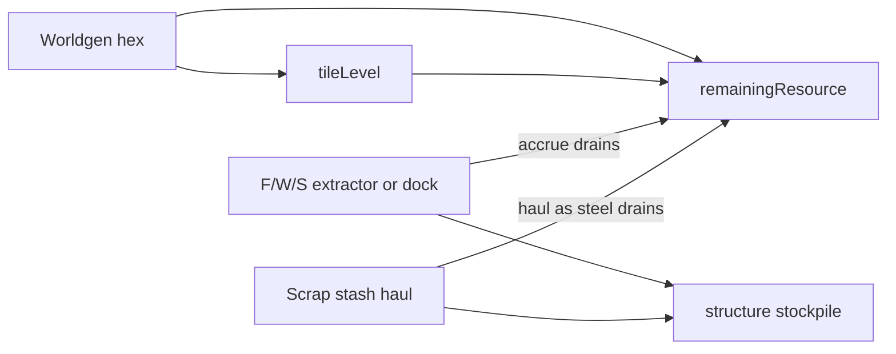

# Milestone 27 — Shared hex remainingResource

**GitHub:** [issue #84](https://github.com/zachflem/hexWorld/issues/84) · [milestone M27](https://github.com/zachflem/hexWorld/milestone/26)  
**Status:** Design locked (#28); implementation not started.  
**Design parent:** [issue #28](https://github.com/zachflem/hexWorld/issues/28) (closed — decision recorded in DESIGN / TWEAKS / PLAYER_GUIDE / ScrapperEconomy Q48–Q50).

Every hex gets a hidden **tile level** and a shared **`remainingResource`**. Food / wood / stone extractors, **docks**, and **scrap stash hauls** all drain that value. Stash-local `remainingSteel` goes away.

---

## Model



| Rule | Notes |
|------|--------|
| Place-anywhere | F/W/S extractors still build on any suitable land; terrain / transition only multiply yield |
| Shared drain | Extractors, docks, and Scrappers decrement the **same** hex `remainingResource` |
| Rebuild | Demolish + rebuild does **not** reset remaining |
| Empty | Yield stops; scrap stash frees the hex when remaining hits 0; **no regen** |
| UI | Show remaining only on **active** extractor / dock / known stash — not empty scouted ground |
| Infinite | `hex_resource_pools.infinite` skips drain (easy/author profiles) |
| Saves | No migration — bump / invalidate older saves OK |

**Formula** (defaults copy today’s scrap bases; add water ≈ shore):

```
remainingResource = round(pool_by_terrain[terrain] × (1 + pool_per_tile_level_pct × (tileLevel − 1)))
```

---

## Impl checklist

- [ ] Add `hex_resource_pools` to `tweaksSchema.ts` + profile `tweaks.jsonc` (defaults from current `scrap_stashes.steel_pool_*`; water base; `infinite` flag).
- [ ] World-gen: per-hex `tileLevel` + `remainingResource` (deterministic from seed).
- [ ] Persist hex pool state in saves (format bump as needed).
- [ ] `accrueResources` / dock accrue drain remaining (honor `infinite`); stop yield at 0.
- [ ] Scrappers (and scout stash sample if applicable) drain the same remaining; remove stash `remainingSteel` / per-stash level roll.
- [ ] Supersede `scrap_stashes.steel_pool_*` as the sizing source (hex pool owns numbers).
- [ ] UI: remaining on extractor / dock / known-stash sheets only.
- [ ] Rates / courier behavior when dry (zero yield; no false income).
- [ ] Tests for drain, rebuild-no-reset, infinite, scrap+extractor sharing one pool.
- [ ] Doc sync: mark TWEAKS “shipped”; keep DESIGN / PLAYER_GUIDE aligned.

---

## Likely touch points

- `src/data/tweaksSchema.ts`, `public/profiles/*/tweaks.jsonc`
- `src/data/scrapStashes.ts`, `src/engine/scrappers.ts`
- `src/engine/tick.ts` (`accrueResources`), `src/engine/docks.ts`
- `src/engine/resourceRates.ts`, save/load (`gamePersistence` / related)
- `src/ui/GameScreen.tsx` (tile sheet remaining)
- `context/TWEAKS.md`, `DESIGN.md`, `PLAYER_GUIDE.md`, `ScrapperEconomy.md` Q48–Q50

---

## Acceptance / testable outcome

- [ ] New games: every hex has shared remaining; F/W/S + dock + scrap drain it.
- [ ] Rebuild on a drained hex does not refill; empty sites stop producing.
- [ ] Known scrap stash remaining matches hex pool; depleting scrap leaves hex dry for extractors.
- [ ] `infinite: true` profile does not drain.
- [ ] No remaining readout on empty scouted hexes.
- [ ] `npm test` / `npm run lint` / `npm run build` green.

---

## Out of scope

- Retuning absolute economy balance beyond first-pass defaults (playtest follow-ups).
- Banded richness hints on empty tiles (explicitly out — structure/stash only).
- Regenerating pools.
