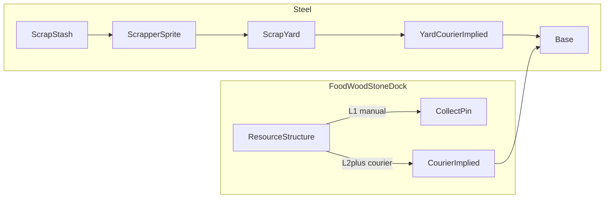

# Scrapper + Courier logistics — design notes (#P11)

Working design doc for **steel Scrappers**, **implied Couriers** on resource structures, and **removal of infrastructure path tiles**. Decisions live here; structured impl brief is [Milestone26.md](Milestone26.md).

**GitHub:** [issue #36](https://github.com/zachflem/hexWorld/issues/36) · [milestone M26](https://github.com/zachflem/hexWorld/milestone/25)  
**Status:** Promoted to **Milestone 26** (was proposed #P11)

---

## Scope

Two transport roles replace path-tile auto-flow:

| Role | Presentation | Loop | Unlocked by |
|------|--------------|------|-------------|
| **Scrapper** | Dedicated sprite (wandering-scout family) | Scrap Yard → scrap stash → Scrap Yard | Scrap Yard build (L1 Scrapper included) |
| **Courier** | **Implied** unit (no train/assign UI; no dedicated scout-like sprite) | Resource structure → **base** → structure | Structure upgrade **L2** (food / wood / stone / dock / Scrap Yard last-mile) |

**Path tiles (goat track / stone road / highway) are removed entirely** when this ships — no parallel path network.

**Not in courier scope:** power (Milestone 25 stations). Steel extraction tiles are removed (Q1); steel only via stashes + Scrapper + yard courier.

---

## Couriers & resource upgrades (Milestone 26)

### Q65 — Courier vs Scrapper presentation

**Decision:**

- **Scrapper:** visible hex-by-hex sprite on the map, art treatment closer to the **wandering scout** than to expedition party markers (see also Q33–Q34).
- **Courier:** **implied** — created by upgrading the structure; player does not train, assign, or lose a discrete courier unit. No dedicated scout-like sprite required for MVP (timer / stockpile motion may still telegraph trips).

### Q66 — Resource structure upgrade track

**Decision:** Food, wood, stone extraction and **docks** use a unified **L1–L5** track (replaces the player-facing meaning of small → mid → large):

| Level | Effect | Milestone |
|-------|--------|-----------|
| **L1** | Manual collection only (collect pin) | Ship |
| **L2** | Automated collection — implied courier loops structure ↔ base | Ship |
| **L3** | Increase production | Ship |
| **L4** | Increase collection speed | Future |
| **L5** | Increase production | Future |

Exact yield / speed multipliers and upgrade costs in tweaks when implemented. Base-level gates for L4/L5 TBD (same family as other structure caps).

### Q67 — Courier destination & distance penalty

**Decision:**

- Courier destination is the **main base** (not outposts) for MVP unless playtest demands hub parity.
- Round-trip travel time reuses expedition route math: Dijkstra path cost over owned∪scouted ground (`findExpeditionPath`) × `expeditions.travel_seconds_per_cost` (`expeditionTravelDurationMs` in `engine/expeditions.ts`). Farther / mountain-heavier routes take longer — that **is** the distance penalty.
- Manual collect (L1 and always available as fallback) stays instant via collect pin; no travel time.

### Q68 — Path tile removal

**Decision:** **Remove** goat track / stone road / highway from the game when Milestone 26 ships (new games; no save migration of path networks — same spirit as Q23). Couriers replace path auto-flow. Impl must strip build UX, `PathTile` persistence, path power consumers, path noise floor, fractional path slot cost, and tick drain via `findResourceTileConnection`.

### Q69 — Scrap Yard last-mile

**Decision (supersedes Q27 yard→hub path rule; revised for L2 parity):** Steel delivered into the yard’s local stockpile enters the **shared global pool** via an **implied yard courier** to base **at yard L2+**, using the same `travel_seconds_per_cost` timing and power gating as resource couriers (Q67). L1 yards are **manual collect only**. Manual collect droplet on the yard remains available at every level (Q59/Q60).

---

## Agreed (Scrapper / stash — prior Q&A)

### Q1 — Steel extraction tiles

**Decision:** Remove steel extraction tiles entirely. All steel enters the economy via scrap stashes discovered on the map and hauled home by Scrapper units.

**Follow-up:** Early-game steel **costs** in upgrades, training, builds, etc. will likely need a balance pass so the new loop doesn't brick progression before the first yard + Scrapper come online. Track in [TWEAKS.md](TWEAKS.md) when implemented.

### Q2 — Stash depletion

**Decision:** Finite, multi-trip. Each stash holds a pool of steel; a Scrapper takes a partial load per visit until the stash is empty.

### Q3 — Stash placement

**Decision:** Placed at **world-gen** with **terrain rules** (e.g. more stashes on certain terrain, excluded from water — exact table TBD). Same seed + map size → same stash layout.

### Q4 — Discovery gate

**Decision:** **Either** wandering scout **or** tower detection unlocks a stash for Scrapper hauls — whichever finds it first.

### Q5 — Scrapper yard placement

**Decision:** Yard can be built on **any owned empty land** (base, outpost, or claimed territory). Scrappers dispatch from that yard to any **known** stash.

### Q6 — Speed & capacity upgrades

**Decision (revised Q58):** Superseded — **yard level = Scrapper level** (one unified L1–L5 track per yard, yard popup only). See **Q58**.

### Q7 — Wandering scout sample

**Decision:** **Each visit** — when a wandering scout steps on / reports from a stash, the player gets a small steel sample (repeatable on revisits).

### Q8 — Scrapper dispatch & yards

**Decision:**

- Player **assigns a stash**; the Scrapper **loops** yard → stash → yard until that stash is empty.
- **Auto (yard L3+):** when the assigned stash is exhausted, the Scrapper picks the **next closest known stash** to its yard (still yard-centric routing).
- **One active Scrapper per yard**; **multiple yards** allowed on owned land; hauled steel lands in that yard's **local stockpile** first, then enters the **shared global pool** via **yard courier** and/or **manual collect** (Q69, Q60) — **not** path auto-flow.
- Yards are normal structures — **can be damaged/overrun** and **repaired** like other buildings.

### Q9 — Stash highlight ring

**Decision:** Grey ring on a stash hex when that tile is **visible via any intel path** — manual scout action, wandering scout visit, or tower range coverage (same combined “tile is known” notion as other intel).

### Q10 — Scrapper vs hordes

**Decision:** Scrapper is **only at risk on the yard tile and the stash tile** — not while traveling between them.

### Q11 — Depleted stash UI

**Decision:** Highlight **ring disappears** when the stash is fully depleted.

### Q12 — Stash count vs map size

**Decision:** **Scale with map size** — same approach as dens (fewer stashes on smaller maps).

### Q13 — Power resource

**Decision (superseded by Milestone 25 / issue #70):** Power is **not** a stockpiled extraction
resource and does **not** use the Scrapper haul loop. Power stations supply capacity over an AoE;
see [Milestone25.md](Milestone25.md).

### Q14 — First yard timing

**Decision:** **Early** — yard buildable once the player has a basic wood/stone economy, **before** steel-heavy upgrades (e.g. knights) would normally demand extraction tiles.

### Q15 — Scrapper lost to hordes

**Decision:** If a horde takes the **stash tile** (or presumably the **yard tile** per Q10) while the Scrapper is there, the **Scrapper is lost** — must be retrained.

### Q16 — Horde on yard tile

**Decision:** **Scrapper lost** and **yard damaged** — yard is repairable like any other structure (not auto-destroyed).

### Q17 — Training a Scrapper

**Decision:** **Retrain at the yard** after loss (Q15) — resource cost + **build timer**, same shape as wandering scout / scout skiff. **First L1 unit ships with the yard build** (Q63), not a separate train step.

### Q18 — Auto-routing unlock

**Decision (revised Q58):** Superseded — **Auto unlocks at yard level 3** on the unified yard/Scrapper level track (Q58). Not global research.

### Q19 — Assign route UI

**Decision:** **Both** — assign from the **yard popup** (pick a known stash) or by **clicking a stash hex** (dispatch from nearest/ chosen yard).

### Q20 — Noise

**Decision:** **Roughly similar** total noise to old passive steel extraction at equivalent yield.

### Q21 — Terrain bias (world-gen)

**Decision:** **Ruins / industrial flavor** — stashes favor **mountain, forest, shore**; **rare on open grassland**. Exact weights TBD in tweaks.

### Q22 — Reassign mid-route

**Decision:** **Player controls destination** — can **cancel or reassign** a Scrapper to a different known stash at any time (not locked until depletion; Auto only applies when no new order is given and current stash is empty).

### Q23 — Existing saves

**Decision:** **No migration** — Scrapper + Courier economy and path removal apply to **new games only**; in-progress saves with steel extraction tiles and/or path networks are not converted (continue/new-game flow as today).

### Q24 — Yard upgrades

**Decision (revised Q58):** Superseded — yard is **upgradeable L1–L5**; yard level and Scrapper capability are **one track** (Q58).

### Q25 — Stash remaining steel UI

**Decision:** **Tile popup** — clicking a known stash shows **remaining steel** in the stash.

### Q26 — Building on stash tiles

**Decision:** Stash hex is **reserved while steel remains**; once **depleted**, it becomes a **normal empty tile** (structures allowed).

### Q27 — Paths

**Decision (superseded by Q68 / Q69 — Milestone 26):**

- ~~Yard → hub path-connected for shared stockpile.~~
- **Yard ↔ stash:** Still **no path tiles** — Scrapper uses expedition-like travel (owned∪scouted).
- **Yard → base:** Implied **yard courier** (Q69), not path network.
- **Food / wood / stone / dock automation:** Implied **structure courier** from L2 (Q66), not path tiles.
- **Path tiles removed** from the game (Q68).

### Q28 — Travel & territory

**Decision:** **Expedition-like routing** over scouted (and owned) ground — **no path network**. **Twist:** tiles the Scrapper **crosses while hauling** that were only **scouted** become **owned** (Scrapper effectively claims a corridor as it works).

### Q29 — Claim-on-cross timing

**Decision:** **Loaded return only** — scouted tiles crossed become **owned** on the trip **back to the yard** (carrying steel), not on the empty outbound leg.

### Q30 — Holding claimed tiles

**Decision:** **Passive claim** — like tower range claim; no garrison required to keep tiles the Scrapper converts on the loaded return.

### Q31 — Tower + stash on same tile

**Decision:** Tower **detection only** — reveals the stash (grey ring) but does **not** drain, block, or consume the stash; stash mechanics unchanged.

### Q32 — Yard unlock vs research

**Decision (revised Q58/Q64):** **Scrap Yard + L1 Scrapper** from the **build menu** (no global research gate). All Scrapper progression is **yard level L1→L5** in the yard popup — nothing on the global research tree.

### Q33 — Scrapper on the map

**Decision (revised Milestone 26):** **Visible dedicated sprite** — Scrapper shown **moving hex-by-hex** on the route. Art direction: **wandering-scout family** (distinct from expedition party markers and from implied Couriers — Q65).

### Q34 — Loaded vs empty sprite

**Decision:** **Distinct loaded sprite** on the return trip (scrap visible); empty outbound uses a separate art state. Implementation may **duplicate the same asset** for both if needed — wire up two states either way.

### Q35 — Movement model

**Decision:** **Expedition-like** — discrete steps per tick; **yard level** sets travel speed per leg (L1 slow → L4 max speed; exact multipliers TBD in tweaks). Baseline duration still scales with route terrain cost × travel-time tweak (same family as Q67).

### Q36 — Notification tray

**Decision:** **Training timer only** in the notification tray (like other build/train timers) — **no tray row** while the Scrapper is traveling on the map (sprite + yard popup carry that).

### Q37 — Reassign mid-route behavior

**Decision:** **Recall → yard → redeploy** when **loaded** (see Q38–Q39). When **empty outbound**, **redirect in place** (Q39) — no yard detour.

### Q38 — Recall while loaded

**Decision (revised Q69):** **Keeps the load** — if recalled while returning with steel, the Scrapper **carries that cargo back to the yard** (credits yard stockpile on arrival; yard courier / manual collect moves it to the global pool); cargo is **not dropped** on recall.

### Q39 — Reassign when empty vs loaded

**Decision:**

- **Empty outbound** (heading to stash, no cargo): **redirect in place** — Scrapper **turns toward the new stash** from its current hex (no yard detour).
- **Loaded return:** **Q37/Q38** — recall to yard with cargo, then redeploy.
- **Expedition parity:** same mid-route travel rules should apply to **expeditions** (and assaults that share expedition routing) in the **same pass** — retarget from current position when “empty,” return-home when “loaded” equivalent — so Scrapper and expedition movement **feel consistent**.

### Q40 — Expedition mid-march redeploy

**Decision:** **Redeploy mid-march** allowed — player can retarget an in-flight expedition to a **new destination**; **provisions / travel cost is recalculated from the party’s current hex** to the new target (not from origin).

### Q41 — Expedition redeploy provisions

**Decision:** **Full re-quote** for the new leg (current hex → new destination) — **no refund** on food already committed to the old route; player pays the new provisions cost to confirm redeploy.

### Q42 — Den / lab assaults vs expeditions

**Decision:**

- **Territory expeditions:** mid-march **redeploy** to a new destination (Q40–41).
- **Den assaults & lab assaults:** **no redeploy** to a different target mid-march — but **cancel + recall** mid-march **is** allowed (party marches home; assault aborted).

### Q43 — Assault cancel: where home is

**Decision:** Recalled assault party **marches back to dispatch origin** (the barracks / hub they launched from).

### Q44 — Assault recall provisions

**Decision:** **No extra food** for the return march — outbound provisions remain sunk; recall leg is free.

### Q45 — Territory expedition cancel

**Decision:** **Yes** — territory expeditions support **cancel/recall mid-march** (in addition to redeploy), same shape as assault recall: march back to **dispatch origin**, **no extra food** for the return leg.

### Q46 — Claim timing & recall

**Decision:**

- Tiles are **claimed as the party crosses them**, **not** batched at march completion (matches current `stepCorridorWalk` / tick resolution in `engine/expeditions.ts` — document as intentional).
- On **recall**, any tiles **already claimed** on the outbound leg **stay owned**.

### Q47 — Cancel Scrapper haul (no redeploy)

**Decision:** **Allowed** — player can **recall** a Scrapper to the yard **without** assigning a new stash (idle at yard). Loaded return still **keeps cargo** (Q38); empty outbound just comes home. Niche use case — supported anyway.

### Q48 — Stash pool size & early-game guarantee

**Decision:**

- Stash haul size is the hex’s shared **`remainingResource`**, sized by terrain × tile level via planned `hex_resource_pools.*` (land defaults copy today’s scrap bases; add **water** for docks). `scrap_stashes.steel_pool_*` / per-stash `remainingSteel` are superseded at impl.
- **Early-game guarantee:** at least **one scrap stash within ~10 tiles** of spawn (base) so steel loop is reachable early.

### Q49 — “Tile level” for stash scaling

**Decision:** World-gen assigns **one tile level per hex** and initializes **`remainingResource`** from it. Scrap stashes **reference that hex value** (no independent per-stash level or steel counter). F/W/S extractors and docks drain the **same** `remainingResource` ([issue #28](https://github.com/zachflem/hexWorld/issues/28)).

### Q50 — Stashes vs other tile uses

**Decision:** There are **no special natural-resource deposit sites** for food/wood/stone — only **terrain buffs/debuffs** for building/yield, plus the shared hex **`remainingResource`**. Scrap stashes are still reserved sites while remaining > 0 (Q26), but their “steel pool” **is** that hex remaining (hauled as steel). After depletion the hex frees; remaining is already zero so a later extractor would find it dry unless the profile sets pools infinite.

**#28 (decided):** One shared `remainingResource` per hex for extractors, docks, and scrap; `remainingSteel` renamed into that field; place-anywhere for F/W/S; rebuild does not reset; no regen; UI remaining only on active resource structures; old saves may be invalidated at ship; profile tweaks may set pools infinite. Implementation is future work — not part of Milestone 26.

### Q51 — Tile level markers: visibility

**Decision:**

- Markers exist in **world-gen data** but are **hidden** from the player for now — **not** shown in scout intel by default; players infer quality from outcomes (yield, stash size, etc.).
- **Banded vague hints** — multiple copy tiers by level range (15+ was one example: *"This tile is rich in resources"*; other bands get different wording). **No exact level number.** Thresholds and strings TBD in tweaks.

### Q52 — Stash popup

**Decision:** Show **remaining steel** (Q25) **plus** the **banded richness hint** (Q51).

### Q53 — Where hints appear

**Decision:** Banded hints show in the **tile menu on all scouted tiles** — not stash-only. This is core **scout intel** (manual scout, wandering scout, tower visibility, etc.); stash popup adds **remaining steel** on top when applicable.

### Q54 — Tile level markers in milestone scope

**Decision:** **In scope for Milestone 26** if implementation is a **minor lift** — world-gen tile level markers + banded hint copy in scouted tile menu ship alongside Scrapper/Courier work (not a separate prerequisite milestone unless eng review says otherwise).

### Q55 — Build slot cap

**Decision:** **Yes** — Scrapper yard counts toward the **build slot cap** like any other structure. It **replaces the steel extraction tile** in the economy and in placement pressure (one yard per tile, same one-structure-per-hex rules).

### Q56 — Yard build & upgrade costs

**Decision (revised Q58):** **L1 build + L1→L2→L3** reuse existing **steel extraction small → mid → large** cost/timer baselines in tweaks. **L3→L4 and L4→L5** costs/timers TBD (likely Formula B extrapolation from the same steel tier curve — confirm in tweaks pass).

### Q57 — Where speed / capacity / Auto live

**Decision (revised Q58):** Superseded — unified **yard level L1–L5** in the yard popup (Q58); not separate speed/capacity/Auto tracks.

### Q58 — Unified yard / Scrapper levels

**Decision:** With **one Scrapper per yard**, **yard level and Scrapper capability are the same track** — upgrading the yard upgrades the unit tied to it (no separate speed/capacity research lines). All upgrades in the **yard popup**; **not** on the global research tree.

| Level | Capability |
|-------|------------|
| **L1** | Slow travel, **light** load capacity (baseline — **included** when Scrap Yard build completes, Q63) |
| **L2** | **Increased speed and capacity** (moderate bump on both) |
| **L3** | **Auto gathering** — when the assigned stash empties, pick next closest known stash to this yard |
| **L4** | **Max speed** |
| **L5** | **Max capacity** |

Linear progression L1→L5; exact speed/capacity numbers and upgrade costs in tweaks. If the Scrapper is **lost** (Q15), retrain at the yard's **current level**.

### Q59 — Upgrade while Scrapper is en route

**Decision:** **Allowed anytime** — player can start a yard level upgrade even while the Scrapper is mid-haul. No recall required. New level perks (speed, capacity, Auto) apply when the upgrade timer completes (including to a Scrapper still on the map).

**UI (reuse existing patterns):**

- **Upgrade indicator:** Same as other structures — yard hex included in `upgradeAvailableKeysFor()` when the next level is unlocked **and** affordable; `drawLevelBadge` uses **`UPGRADE_AVAILABLE_BADGE_COLOR`** (orange) on the yard level badge. Tile action sheet tabs keep the same `upgradeAvailable` border cue.
- **Collect droplet (yard):** Reuse the **collect-pin droplet** stack (`CollectPinOverlay`, `collectPinColorState`, `COLLECT_PIN_COLORS`) on the **Scrapper yard** when it has **stockpiled steel** — steel icon, fill/color from **yard stockpile ÷ cap** (same normal / warning / full thresholds as extraction tiles). One-click **collect** into the shared pool. Auto delivery uses the **yard courier** (Q69), not path connectivity. Orange droplet when stockpile is low **and** next yard level is affordable (upgrade wins only when stockpile ratio is normal, per existing `collectPinColorState` precedence). **Not** on stash hexes — stash map intel stays **grey ring** + tile popup (Q9, Q25, Q52).

### Q60 — Collect droplet placement (correction)

**Decision:** **Yard only** — player misspoke earlier (“stash capacity droplet”); the map pin is the standard **collection droplet on the yard**, not on scrap stashes.

### Q61 — Yard stockpile cap

**Decision:** **Flat cap** — same local stockpile cap as a **small steel extraction tile** today (not scaled by yard level). Level affects **haul load per trip**, not yard buffer size.

### Q62 — Base level vs yard L5

**Decision:** **Cap at L3 by default** — yard follows the normal base-level structure cap through **L3** (replacing the old 3-tier steel extraction curve). **L4 and L5 require base level 4+** (explicit gate — exact base level TBD in tweaks if 4 isn't the right breakpoint).

### Q63 — L1 Scrapper on first build

**Decision:** **Included in yard build** — completing the L1 Scrap Yard build timer delivers the yard **with its L1 Scrapper ready** (one timer, not a second train step). **Retrain after loss** (Q15) remains a separate cost + timer at the yard's current level (Q17 shape).

### Q64 — Build menu name

**Decision:** **Scrap Yard** — player-facing name for the structure that replaces steel extraction tiles.

### Q70 — Stash map art

**Decision:** Known scrap-stash hexes draw a **resource-marker overlay** like food/wood/stone/steel pins — art lives in the same folder as those sprites (`public/profiles/{slug}/assets/resources/`). Use the pack’s **`scrap-#.png`** variants (`scrap-1.png`, `scrap-2.png`, …); pick **one variant per stash at world-gen**, seeded so the same seed + map size always gets the same art index (not a live random flicker). Missing higher numbers simply aren’t in the roll set — discover files or a fixed list at load time. Depleted stashes follow Q11/Q26 (ring off / hex freed); sprite treatment for empty may hide or stay until the hex is freed — match resource-pin fade conventions when implementing.

---

## Open questions / remaining work

**Design Q&A complete (Q1–Q70).** Impl shipped on Milestone 26 / #36. Remaining playtest:

- **Tweaks tuning** — early steel costs vs stash pools, Scrapper speed/capacity, courier cadence, banded hint copy.
- Finite food/wood/stone hex pools ([issue #28](https://github.com/zachflem/hexWorld/issues/28)) — **design decided**; engine/impl still future (out of M26 scope).

---

## Related scope (expedition parity)

When Milestone 26 ships Scrappers, audit **expedition / den assault / lab assault** in-transit behavior and align with Scrapper redirect vs recall-home rules above (checklist row on the milestone).
